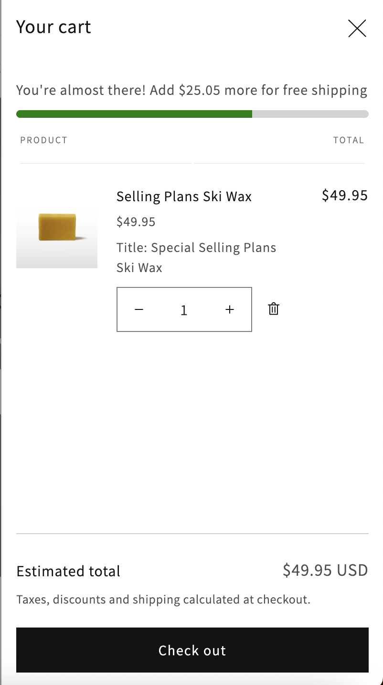
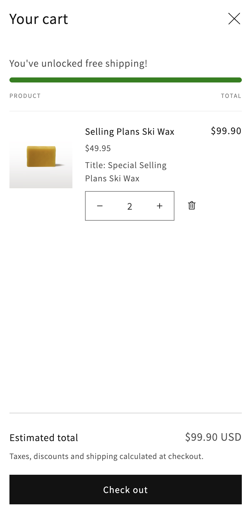

# Cutty Theme
A Shopify theme built on Dawn as a learning and portfolio project

## What's included
- Hero banner section
- Custom collection section
- FAQ accordion section
- Size guide block
- Free shipping progress bar

## Free Shipping Progress Bar

A progress bar that shows how close a customer is to free shipping. It appears on the cart page and in the cart drawer, and it updates live without a page reload.

### Features

- Shows the amount remaining, formatted with the store's money format, and a success message once the threshold is reached
- Updates live when quantities change, using Dawn's cart events and the Section Rendering API
- Works on the cart page and in the cart drawer from one shared snippet
- Separate thresholds for USD and CAD, set in Theme settings
- Hidden in an empty drawer, and for any currency without a configured threshold
- Accessible: `role="progressbar"` with `aria-valuenow`, and an `aria-live="polite"` message

### How it works

| File | Purpose |
|---|---|
| `snippets/free-shipping-bar.liquid` | Calculates the threshold, remaining amount, and percentage, and renders the `<free-shipping-bar>` element |
| `sections/free-shipping-bar.liquid` | Thin wrapper that places the snippet on the cart page |
| `snippets/cart-drawer.liquid` | Renders the same snippet below the drawer header |
| `assets/free-shipping-bar.js` | Custom element that subscribes to Dawn's cart update event |
| `assets/free-shipping-bar.css` | Styles for the track and fill |
| `config/settings_schema.json` | "Free shipping bar" theme settings |

**Live updates.** When Dawn publishes a cart update, the element fetches `?section_id=<id>` for its own section, parses the response, and copies the new fill width, message, and `aria-valuenow` onto the existing elements. Updating in place keeps the CSS width transition working and keeps the live region intact. Liquid does all the calculation, so the logic is not duplicated in JavaScript.

**Currency.** The snippet picks the threshold with `cart.currency.iso_code`. A currency with no configured threshold renders no bar.

### Settings

In the theme editor, open Theme settings, then Free shipping bar:

- Threshold (USD) and threshold (CAD)
- Progress message. Use `{amount}` where the remaining amount should appear.
- Success message

### Known limitations

- The bar is display only. The thresholds must be kept in sync manually with the free shipping rates in Shipping and delivery settings.
- One threshold setting per currency. A store with many currencies would need a different approach, such as a metaobject.
- Screen reader testing: the message update was announced with Safari + VoiceOver, but not with Brave + VoiceOver.
- Tested manually. There are no automated tests yet.
- Built and tested against Dawn [16.0.0]

## Development setup

**Requirements**
- Node.js v24.21.0
- Shopify CLI 4.8.5
- A Shopify store with a development theme

**Run it**
1. Clone the repo and `cd` into it.
2. Start the dev server: `shopify theme dev --store <your-store> --theme-editor-sync`
3. Open the local preview URL the CLI prints (`http://127.0.0.1:9292`).
4. To use the theme editor, open the editor link the CLI prints, so the preview includes your local code.

**Working with editor changes**
- `--theme-editor-sync` writes editor changes (section placement, theme settings) back into your local JSON files. Without it, those changes exist only on the dev theme.
- Structure and settings are edited in the theme editor. Liquid, CSS and JS are edited in VS Code. Avoid editing the same JSON file in both places at once.

## Credits
Built on [Dawn](https://github.com/Shopify/dawn) by Shopify, MIT licensed. The original license is kept in LICENSE.md.